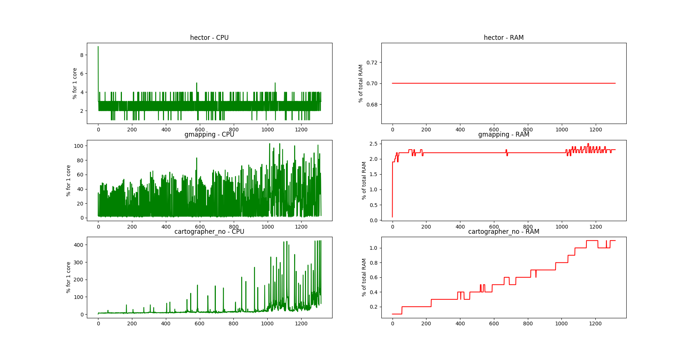
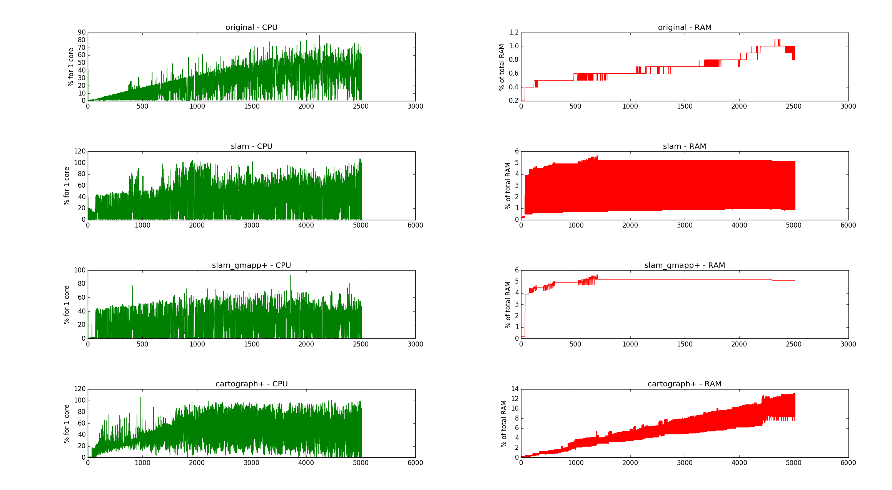
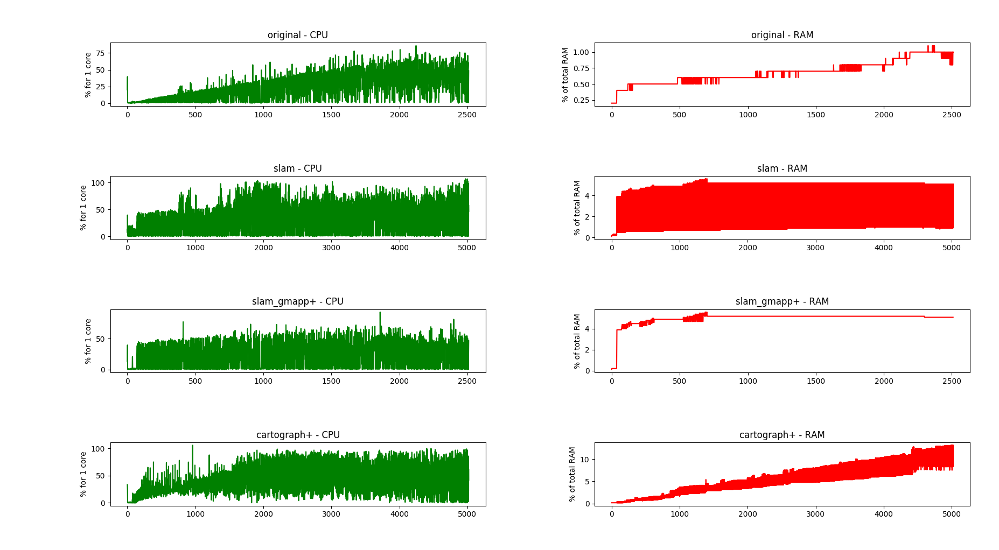

# Benchmarking_SLAM

Tools and files to evaluate map and localization quality of SLAM technologies

Project by Paul Asquin for Awabot - Summer 2018 paul.asquin@gmail.com

### python3 fundamental packages
sudo apt-get install python3-pip python3-tk python3-pil

pip3 install numpy

pip3 install matplotlib

pip3 install pyyaml
### Plot_top.py may need to be slightly modified depending on the system language you are using.

Modified by Richard Zander 

# [map_crop.py](map_crop.py)  

With [map_crop.py](map_crop.py), you can automatically crop pgm files to the exact size used by the map.
To do so, create a folder named _maps_ and copy there your .pgm and .yaml files generated with [map_server map_server](http://wiki.ros.org/map_server#map_saver).  
Then, run 
```
python3 map_crop.py
```

# [metrics.py](metrics.py)

[metrics.py](metrics.py) will return the proportion of occupied pixels (black pixels = obstacles) of every map under the _maps_ folder.  
Run  
```
python3 metrics.py
```

# [plot_top.py](plot_top.py)

With [plot_top.py](plot_top.py), you can plot the use of CPU and RAM of wanted processes using a top.txt file.  
In order to generate this file under a GNU/Linux OS, you can start your processes then run 
```
top -b -d 1 > top.txt
```   

By default, the script will listen to processes containing the names "hector", "gmapping" and "cartographer_no". 
You can change them by editing the SELECT_PROCESS global parameter in the script.  

In the end, you will be able to plot graph like this one : 


Graph of CPU and RAM use of Hector SLAM, GMapping and Google Cartographer

### Python2.7 is able to run these programs but there are some bugs：
## [plot_top.py](plot_top.py)
py27 Graph of CPU and RAM use of different algorithms


py35 Graph of CPU and RAM use of different algorithms


# [metrics.py](metrics.py)
py27:
proportion ranked : [[u'aces_cartographer.pgm', 0], [u'aces_gmapping.pgm', 0], [u'aces_original.pgm', 0], [u'aces_slam.pgm', 0]]

py35:
proportion ranked : [['aces_gmapping.pgm', 0.056157280842924415], ['aces_slam.pgm', 0.07968770909621771], ['aces_original.pgm', 0.09663862018003493], ['aces_cartographer.pgm', 0.5007652916030205]]


